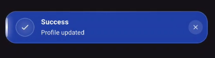
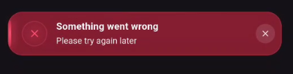
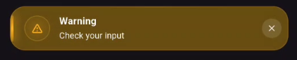
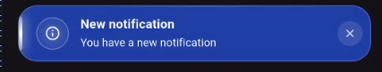
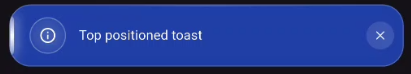
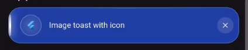

[](https://pub.dev/packages/toastio)
[](https://pub.dev/packages/toastio/score)
[](https://pub.dev/packages/toastio)

# toastio

A lightweight, animated Glassmorphism toast package for Flutter with global and context-based APIs.

## Features

- Success, error, warning and info toast types
- Global toast without passing `BuildContext`
- Context-based API
- Glassmorphism UI with blur
- Smooth fade, slide and scale animations
- Close button
- Auto dismiss
- Custom background and text colors
- Custom icon and leading widget
- Top, center and bottom positions
- No GetX or other third-party dependencies

## 📸 Screenshots

<p align="center">
  
  
  
</p>

<p align="center">
  
  
  
</p>

## Installation

Add the package to your `pubspec.yaml`:

```yaml
dependencies:
  toastio: ^1.0.1
```

Then run:

```bash
flutter pub get
```

## Global Setup

Create a navigator key:

```dart
final navigatorKey = GlobalKey<NavigatorState>();
```

Initialize the package:

```dart
void main() {
  WidgetsFlutterBinding.ensureInitialized();

  Toastio.initialize(navigatorKey);

  runApp(
    MaterialApp(
      navigatorKey: navigatorKey,
      home: const HomePage(),
    ),
  );
}
```

Now you can call a toast from anywhere:

```dart
Toastio.success('Profile updated');

Toastio.error(
  'Something went wrong',
  title: 'Error',
);

Toastio.warning('Please check your input');

Toastio.info('New message received');
```

## Context API

If you already have a `BuildContext`:

```dart
Toastio.show(
  context,
  'Saved successfully',
  type: ToastType.success,
);
```

## Customization

Customize the toast appearance, duration, position, colors, and close button:

```dart
Toastio.showGlobal(
  'Custom toast',
  type: ToastType.info,
  title: 'Information',
  duration: const Duration(seconds: 4),
  bgColor: Colors.black,
  textColor: Colors.white,
  position: ToastPosition.bottom,
  showCloseButton: true,
);
```

### Custom Icon

```dart
Toastio.showGlobal(
  'Upload complete',
  icon: const Icon(Icons.cloud_done),
);
```

### Custom Leading Widget

```dart
Toastio.showGlobal(
  'New message',
  leading: const CircleAvatar(
    radius: 12,
    child: Icon(Icons.person, size: 14),
  ),
);
```

## Dismiss Manually

You can dismiss the currently visible toast manually:

```dart
Toastio.dismiss();
```

## Toast Positions

Toast messages can be displayed at different positions:

```dart
Toastio.showGlobal(
  'Top toast',
  position: ToastPosition.top,
);
```

Available positions:

- `ToastPosition.top`
- `ToastPosition.center`
- `ToastPosition.bottom`

## Duration

Set a custom duration for the toast:

```dart
Toastio.showGlobal(
  'This toast stays longer',
  duration: const Duration(seconds: 4),
);
```

## Example

Check the `example/` directory for a complete Flutter example demonstrating the available toast types and customization options.

## Contributing

Contributions are welcome! ❤️

If you have an idea, bug fix, improvement, or new feature, feel free to contribute.

### How to Contribute

1. Fork the repository
2. Create a new branch

```bash
git checkout -b feature/my-feature
```

3. Make your changes
4. Test your changes

```bash
flutter test
```

5. Commit your changes

```bash
git commit -m "Add my feature"
```

6. Push your branch

```bash
git push origin feature/my-feature
```

7. Open a Pull Request

Please keep contributions clean, focused, and consistent with the existing code style.

## Issues & Suggestions

Found a bug or have an idea?

Feel free to open an issue and share your feedback. Every suggestion and contribution is appreciated.

## License

MIT License.
